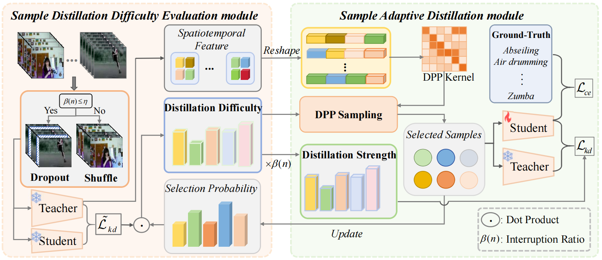

# Sample-level Adaptive Knowledge Distillation for Action Recognition


## Introduction

Knowledge Distillation (KD) compresses neural networks by learning a small network (student) via transferring knowledge from a pre-trained large network (teacher). Many endeavours have been devoted to the image domain, while few works focus on video analysis which desires training much larger model making it be hardly deployed in resource-limited devices. However, traditional methods neglect two important problems, i.e., 1) Since the capacity gap between the teacher and the student exists, some knowledge w.r.t. difficult-to-transfer samples cannot be correctly transferred, or even badly affects the final performance of student, and 2) As training progresses, difficult-to-transfer samples may become easier to learn, and vice versa. To alleviate the two problems, we propose a Sample-level Adaptive Knowledge Distillation (SAKD) framework for action recognition. In particular, it mainly consists of the sample distillation difficulty evaluation module and the sample adaptive distillation module. The former applies the temporal interruption to frames, i.e., randomly dropout or shuffle the frames during training, which increases the learning difficulty of samples during distillation, so as to better discriminate their distillation difficulty. The latter module adaptively adjusts distillation ratio at sample level, such that KD loss dominates the training with easy-to-transfer samples while vanilla loss dominates that with difficult-to-transfer samples. More importantly, we only select those samples with both low distillation difficulty and high diversity to train the student model for reducing computational cost. Experimental results on two video benchmarks and one image benchmark demonstrate the superiority of the proposed method by striking a good balance between performance and efficiency.

<p align="center">

</p>

## Installation

The code was tested on a Conda environment installed on Ubuntu 18.04.

Install [Conda](https://docs.conda.io/en/latest/miniconda.html) and then create an environment as follows:
- Python 3.8.19 :

```
conda create -n slpkd python=3.8.19 
```

```
conda activate slpkd
```
- Pytorch 1.7
- CUDA 10.1

```
conda install pytorch==1.7.0 torchvision==0.8.0 torchaudio==0.7.0 cudatoolkit=10.1 -c pytorch
```


```setup
pip install opencv-python
```
```setup
pip install pandas,gluoncv,thop,pillow==8.4.0
```
Replace the slowfast.py file with the file located at ../gluoncv/model_zoo/action_recognition/slowfast.py

## Dataset Requirements

### UCF101

Follow the instructions [here](https://www.crcv.ucf.edu/data/UCF101/UCF101.rar) to download the dataset.

Then, extract and organize the files inside your cloned repo directory as follows (note that only the necessary files are shown):

```text
SLPKD/
└── UCF101/
  │   ├── videoset.csv  (videos metadata file)
  │   ├── Videos/
  │   │   └── *.avi    (video files)
  │   └── text_annotations/
  │       ├── ucf101_annotation.txt (actual text annotations)
```


## Training&Test
First, download the Kinetics-400 pretrained weights of Slowfast16*8 from this [link](https://pan.baidu.com/s/1Y_jfUR_t7n7r3yT5WG886w 
) (code is rsu6). Place the downloaded file inside your cloned repo directory as `checkpoint/slowfast_resnet101.pth`.

Next, run `python ucf101_slowfast_ac.py  --batch_size 16 --model slowfast_resnet50 ` to train the model in the paper.

## Quantitative results on UCF101.

| KD Method | Method | Acc(TOP-1) | Acc(TOP-5 )
| :----: |:----: | :--: | :---------: | 
|  KD |Slowfast| 89.88|    98.80    | 

## Qualitative results 


<p align="center">
     <br>
</p>

Qualitative comparison between the baseline and our distilling method on UCF101


## Acknowledgement
We would like to thank the authors of [TT]( https://github.com/zhipeng-wei/TT) which has significantly accelerated the development of our KD Method.